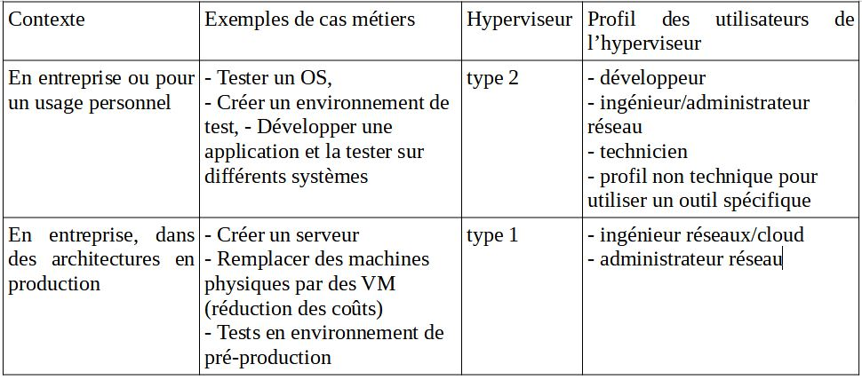

# Virtualisation
---

# Interets de la virtualisation
--

- Permet d'utiliser un logiciel sur un OS different de celui d'origine
- Faire cohabiter simultanement differents "univers" sur une machine
- creer differents environnements de developpement et/ou de tests specifiques sur une meme et unique machine.
---

# Les Hyperviseurs
--

Un hyperviseur est une plateforme de virtualisation qui permet a plusieurs systemes d exploitation de travailler sur une meme machine physique en meme temps. 
---

 # Pricipes Fondamentaux
 --
 
 ## Cloisonnement
chaque systeme d’exploitation a un fonctionnement independant, et ne peut 
interferer avec les autres en aucune maniere.
--

## La transparence 
Le fait de fonctionner en mode virtualise ne change rien au fonctionnement du systeme d exploitation et a fortiori des applications. 
La transparence implique la compatibilite : toutes les applications peuvent tourner sur un systeme virtualise, et leur fonctionnement n’est en rien modifie.
---

## Hyperviseur de Type 2
--

Avantage :
Facile a mettre en place elle s'instale comme une application, une fois installe elle de creer des VM independantes de l’OS hote.

Inconvenient :
Il est donc considere comme n’importe quelle application et n’a aucune priorité sur les ressources de l’hote. 

Si une application decide soudainement qu’elle a besoin de 95 % des ressources de votre machine pour ouvrir un fichier extremement volumineux, votre hyperviseur va se retrouver avec moins de 5 % des ressources pour faire tourner toutes ses VM.
---

## Hyperviseur de Type 1
--
Installe directement sur le materiel sans OS intermediaire. Il a un acces direct au ressource de l'appareil.  

Avantages :
- Plus de probleme de performance 
- Moins de machine phisique et donc moins de maintenance
- Gain financier
- Mutualiser les ressources et reartir les charges
--

Inconvenient :
- Prix de licence souvent eleve
---

# Quelques hyperviseurs 
--

## VirtalBox

Avantages : 
- Facile d'utilisation
- Open Source

Inconvenient :
- Moins performant
- Donnees non chiffrees par defaut
--

## VM Ware

Avantages : 
- Performant 
- Donnees chiffrees

Inconvenient :
- Certaines foctionalitees sont payante 
--

## Hyper V

Avantages : 
- Performant
- Donnees chiffrees
- Deja installe sur W10 Pro
- Gratuit

Inconvenient :
- Difficile d'utilisation
- Uniquement sur Windows 10 Professionnel
---

---

# Les types de connexion au reseau
--
## Bridge
--

## NAT
network address translation 
--

## Host-Only
--

##  LAN Segment
--
