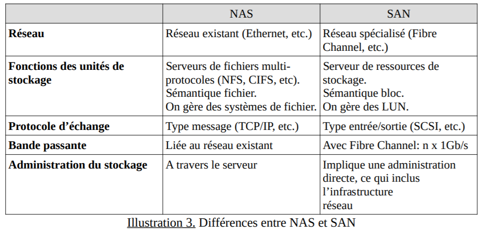

# Virtualisation du stockage
---

## Principe de base

La virtualisation du stockage est de gerer une interface qui permet de dissocier la gestion physique des disques (et des baies de stockage) vis-a-vis des serveurs qui l'utilisent.
---

## Les differents modes de stockage
--

### Le stockage en mode fichier

Egalement appele stockage base sur des fichiers : les donnees sont stockees en tant qu element unique d information a l interieur d un dossier, tout comme des documents imprimes ranges dans un carton. Pour que vous puissiez acceder a une donnee, votre ordinateur doit connaitre le chemin a parcourir pour la trouver. Les donnees stockees dans des fichiers sont organisees et recuperees a l aide de quelques metadonnees qui indiquent a l ordinateur ou le fichier se trouve. Le systeme fonctionne comme un catalogue.
--

## Le stockage en mode bloc 

Il rassemble les donnees en blocs qui sont stockes en tant qu elements separes. Chaque bloc de donnees se voit attribuer un identifiant unique, qui permet au systeme de stockage de conserver les petits elements a l emplacement le plus pratique. Cela signifie que certaines donnees peuvent etre stockees dans un environnement Linux, tandis que d autres seront stockees sur une unite Windows.
---

## Les technologies
--

## DAS

Direct-attached storage (ou disque en attachement direct) decrit un type de peripherique de stockage relie directement a un ordinateur et non accessible a d autres ordinateurs ou un serveur. L exemple le plus typique d un stockage DAS est le disque dur interne d un ordinateur ou d un serveur.
--

## NAS

Network Attached Storage ou serveur de stockage en reseau. Cette methode permet de connecter une baie de stockage sur le reseau au moyen de plusieurs protocoles tels que AFS, CIFS, FTP, NFS, SSH, WebDav. Des peripheriques heterogenes, connectes sur un meme segment reseau, peuvent y acceder a travers une adresse IPv4 ou IPv6.
--

## SAN

Storage Area Network ou reseau de stockage en francais. Cette methode permet de mutualiser les baies de stockage dans un reseau dedie
--

### Avantages du NAS et SAN par rapport au DAS

 L environnement de stockage est evolutif. A tout moment, des ressources peuvent etre ajoutees au fur et a mesure de l augmentation de la demande. 
 
 Les ressources non utilisees peuvent etre facilement attribuees a un autre serveur ou dediee a une autre utilisation 
 
 L administration est centralisee sur un seul peripherique de stockage. Le technicien n a plus besoin de gerer une multitude de peripheriques.
--

## Differences entre NAS et SAN
--

## NAS

- Un peripherique NAS possede son propre systeme de fichier 

- Les fichiers sont directement ecrits sur le NAS.

- Un peripherique de stockage peut partager plusieurs volumes differents sur un meme reseau.

- Un NAS peut gerer les acces concurrents en ecriture. On parle alors de donnees partagees.

- Un partage peut etre multi-protocolaire. 
--
## SAN

- Dans un SAN, le serveur gere le systeme de fichier des espaces de stockage auxquels il a acces. Plusieurs serveurs peuvent acceder a des espaces de stockage sur le meme peripherique. On appelle ces espaces de stockage des LUN.

- Un serveur considere un LUN, sur lequel il est connecte, comme un disque dur local. Par consequent, l OS du serveur gere le systeme de fichiers du LUN. Chaque serveur considere l espace disque d une baie SAN auquel il a acces comme son propre disque dur.
--

- S il peut y avoir un acces concurrent en lecture sur un LUN, il n y a pas d acces concurrent en ecriture. Par consequent, un seul et unique serveur ecrit des donnees sur un LUN.

- Un SAN peut etre cable en fibre optique. 
--

- En fibre optique SAN, les materiels sont relies entre eux par un ou plusieurs commutateurs Fibre Channel. On parle de switchs ou de directors. Ils sont de gros commutateurs de plus de 64 ports, garantissant une disponibilité maximale et une évolutivité.

- Il n existe pas d’adressage IP dans le cadre d’une utilisation de la fibre optique. Les péripheriques sont identifies et accedes par leur WWN (World Wide Name), WWPN (World Wide Port Name) ou WWNN (World Wide Node Name). Le WWN est l equivalent de l adresse MAC.
---

--

